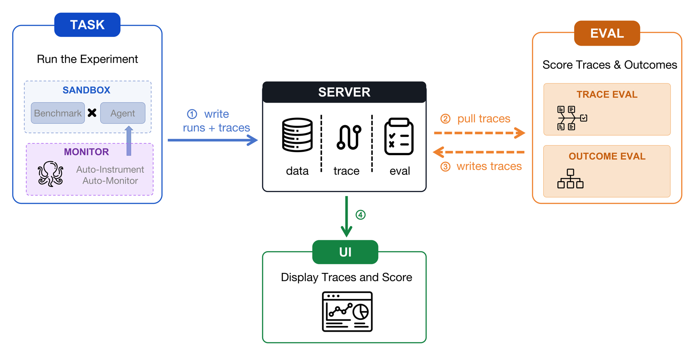

<p align="center">
  
</p>

<h1 align="center">
  
  &nbsp;&nbsp;An End-to-End Agent Auditing Engine
</h1>

<p align="center">
  <em>An agent auditing engine — evaluate any agent on any dataset, with full trace visibility.</em>
</p>

<p align="center">
  <strong>English</strong> | <a href="README_zh.md">中文</a>
</p>

---

## Overview

**A<sup>2</sup>E** (Agent Auditing Engine) is an end-to-end auditing engine for agent
harnesses. It uses the **Agent Task Protocol (ATP)** to plug evaluation tasks into
different harnesses quickly, captures standardized execution traces via an
auto-instrumented **Monitor**, and scores harness capabilities with
multidimensional metrics beyond accuracy alone.

The core loop is **TASK → SERVER → EVAL → UI**. **TASK** runs Benchmark × Agent
(optionally in a sandbox) while **Monitor** auto-instruments the run and writes
runs + traces to **SERVER**. **EVAL** then pulls traces from the server, scores
both the process (**TRACE EVAL**) and the final result (**OUTCOME EVAL**), and
writes scores back. **UI** reads from the server to display traces and scores.
**SERVER** is the hub that stores data, traces, and eval results for the other
three stages.

<p align="center">
  
</p>

## Project Structure

```
AEP/
├── server/              # Backend + REST API + a2e-client SDK
├── task/                # Datasets, agents, experiment runners
│   ├── datasets/        # Benchmark adapters
│   ├── agents/          # Agent framework adapters
│   ├── runners/         # Registry (DATASETS / AGENTS / EVALUATORS)
│   └── examples/        # CLI: run_experiment.py
├── eval/                # Standalone evaluation pipeline
├── monitor/             # OpenInference instrumentation
├── ui/                  # React experiment viewer
└── example/             # Interactive walkthrough script
```

## Contents

1. [Configuration](#1-configuration)
2. [Task Layer](#2-task-layer)
3. [Eval Layer](#3-eval-layer)
4. [UI Layer](#4-ui-layer)

## 1. Configuration

### Prerequisites

| Tool | Version | Notes |
|------|---------|-------|
| **Python** | 3.10 – 3.14 | `uv python install 3.11` |
| **uv** | latest | `curl -LsSf https://astral.sh/uv/install.sh \| sh` |
| **Docker** | any | Only for sandbox datasets (swe-bench, terminal-bench) |
| **Node.js + pnpm** | Node 18+ | Only if you rebuild the UI |

### Install & credentials

```bash
# task — experiments / datasets / agents
cd task && uv sync --frozen --all-packages --index-strategy unsafe-best-match

# server — a2e serve + REST API
cd server && uv sync

# eval — standalone evaluation pipeline
cd eval && uv sync

cp .env.example .env   # then fill in real keys
```

`.env` (gitignored):

```bash
A2E_MODEL=qwen3-coder-plus        # default model for all agents
OPENAI_API_KEY=sk-...
OPENAI_API_BASE=...
ANTHROPIC_API_KEY=sk-...          # claude-sdk only
ANTHROPIC_BASE_URL=...            # no trailing /v1
```

Priority: **CLI flags > `.env` / env vars > code defaults**.

| What to change | Where |
|----------------|-------|
| Default model | `.env` → `A2E_MODEL` |
| One-off model | CLI `--model` |
| OpenAI-compatible endpoint / key | `.env` → `OPENAI_API_BASE` / `OPENAI_API_KEY`, or `--api-base` / `--api-key` |
| Anthropic endpoint / key | `.env` → `ANTHROPIC_BASE_URL` / `ANTHROPIC_API_KEY` |
| Where trajectories land | `A2E_WORKING_DIR` when starting `a2e serve` (unset → `~/.a2e/a2e.db`) |

Optional:

```bash
# Rebuild UI
cd ui && pnpm install && pnpm build

# autogen-agentchat (isolated — protobuf conflict with main workspace)
cd task/agents/autogen_agentchat && uv sync --index-strategy unsafe-best-match
```

### Three rules before every run

1. **Start `a2e serve` first** — experiments upload datasets / spans to the running backend.
2. **`no_proxy` must include `127.0.0.1,localhost`** — otherwise spans are swallowed by a local proxy and `a2e.db` shows `spans=0`.
3. **DB location follows the serve process** — set by `A2E_WORKING_DIR` at serve time; the experiment CLI only writes to whatever backend is up.

Standard prelude (every experiment terminal):

```bash
cd task
set -a; . ../.env; set +a
export no_proxy="127.0.0.1,localhost,${no_proxy:-}"; export NO_PROXY="$no_proxy"
```

## 2. Task Layer

Entry point: `task/examples/run_experiment.py`.

### Start server + run an experiment

```bash
# Terminal 1 — keep open
cd server && uv run a2e serve      # → http://localhost:6006

# Terminal 2
cd task
set -a; . ../.env; set +a
export no_proxy="127.0.0.1,localhost,${no_proxy:-}"; export NO_PROXY="$no_proxy"
uv run --frozen python examples/run_experiment.py \
  --dataset tau-bench --agent agno --model qwen-max \
  --evaluators tool_recall,llm_judge --domain retail
```

Or follow the interactive walkthrough: `bash example/run_examples.sh`.

### CLI

```bash
uv run --frozen python examples/run_experiment.py \
  --dataset <dataset> \
  --agent   <framework>      # default: agno
  --model   <model>          # default: A2E_MODEL from .env
  --evaluators <a,b,...>     # default: exact_match,substring
  --n       <count>          # default: 40
  --sample-seed 20260721     # optional, reproducible sample
  --domain  retail           # tau-bench / tau2 only
```

| Flag | Purpose |
|------|---------|
| `--list` | Print all datasets / agents / evaluators (source of truth) |
| `--dataset` | Dataset name (required) |
| `--agent` | Agent framework (default `agno`) |
| `--model` | Override `A2E_MODEL` for this run |
| `--evaluators` | Comma-separated scorers |
| `--n` | Sample size (absolute count, random without replacement) |
| `--domain` | `retail` / `airline` (tau-bench / tau2) |

```bash
uv run --frozen python examples/run_experiment.py --list
```

### Datasets / agents / evaluators

| Kind | Examples |
|------|----------|
| Tool-use | tau-bench, tau2, tau3, traject-bench |
| QA | mmlu, gsm8k, humaneval, gpqa, mmlu-pro, math, bbh, … |
| Sandbox | swe-bench-lite, swe-bench-verified, swe-bench-pro, terminal-bench-2, terminal-bench-2.1 |

| Group | Frameworks |
|-------|------------|
| Agent-first | smolagents · agno · llama-index |
| Orchestration | langgraph · crewai · google-adk · autogen-agentchat |
| Vendor SDKs | claude-sdk · openai-agents |

Built-in evaluators: `exact_match`, `substring`, `tool_recall`, `numeric_match`,
`mc_letter`, `swe_resolved`, `swe_fail_to_pass`, `swe_pass_to_pass`, `tb_resolved`,
plus `llm_judge`. Recommended combos live in `task/runners/.../registry.py`
(`default_evaluators`).

### Sandbox tips

Needs Docker and pullable images (1–3 GB each). Pin a cached instance before formal runs:

```bash
A2E_SWE_INSTANCE="<cached_instance_id>" \
uv run --frozen python examples/run_experiment.py \
  --dataset swe-bench-lite --agent agno --n 1 \
  --evaluators swe_resolved,swe_fail_to_pass,swe_pass_to_pass
```

- `swe-bench-pro` → `A2E_SWE_PRO_INSTANCE`
- `terminal-bench-2` → `A2E_TB2_TASK=<task>`

### View results

Open http://localhost:6006:

| Page | What you see |
|------|----------------|
| `/datasets` | Uploaded samples |
| `/experiments` | Per-sample scores |
| `/projects` | OpenTelemetry trace trees (LLM + tool calls) |

Task traces live under the **`Experiment-<id>`** project.

## 3. Eval Layer

The eval layer pulls existing traces, scores them, and writes results back.
Task runs do not require eval; pass `--evaluators` on the task CLI for lightweight
inline scoring, or use `eval/` for deeper metric groups.

### Run all metrics

```bash
# Terminal 1
cd server && uv run a2e serve

# Terminal 2
cd server
uv run python ../eval/scripts/run_eval.py \
  --base-url http://localhost:6006 \
  --experiment-id <id> \
  --part all
```

### Run one metric group

Supported parts:

```text
plan, skill, memory, tool, correct, efficiency, safety
```

```bash
cd server
uv run python ../eval/scripts/run_eval.py \
  --base-url http://localhost:6006 \
  --experiment-id <id> \
  --part plan
```

## 4. UI Layer

React experiment viewer. Production build is served by `a2e serve` at
http://localhost:6006. Swipe between **Task / Trace / Eval** for the same sample;
open the Trace panel for the span tree.

### Production

```bash
cd ui && pnpm install && pnpm build
cd server && uv run a2e serve       # http://localhost:6006
```

Artifacts go to `ui/dist/`. The server mounts them automatically.

### Development (HMR)

```bash
# Terminal 1
cd server && uv run a2e serve       # http://127.0.0.1:6006

# Terminal 2
cd ui && pnpm install && pnpm dev   # http://127.0.0.1:5173  (proxies /v1 → :6006)
```

Or use `a2e serve --dev` for Vite HMR via the server templates.

## Acknowledgements

A<sup>2</sup>E depends on and draws from the following open-source projects:

- [OpenInference](https://github.com/Arize-ai/openinference)
- [Phoenix](https://github.com/Arize-ai/phoenix)
